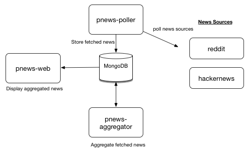

# pnews
Programming news aggregator service in nodeJS.

Simple website that aggregates news about programming/software development from various sources and aggregates it
nicely.

**At this point pnews is still very limited in functionality, just getting started!**

Currently the only news source are [reddit.com/r/programming](https://reddit.com/r/programming) and
[hackernews](https://news.ycombinator.com).

The Architecture of pnews is based on a number of microservices (actually, "nanoservice" might be more appropriate):
- pnews-web: webinterface
- pnews-poller: polls news from news sources
- pnews-aggregator: aggregates previously fetched news into something that is consumable by pnews-web

The services interact with each other as follows:



# Why? #

Because I can :-)
Also, because I want to play around with some new technologies:
- [NodeJS](https://nodejs.org/en/)([ExpressJS](http://expressjs.com/), [Jade](http://jade-lang.com/))
- [ReactJS](https://facebook.github.io/react/)
- [MongoDB](https://www.mongodb.org/)
- Reddit/HackerNews APIs

# Getting started #

## pnews-web ##
To run the web app:
```bash
cd web
npm install
node app.js
```

Web app development:
```bash
cd web
npm install
sudo npm install -g forever
export WEB_SERVER_PORT=3000
export MONGO_DB_URL="mongodb://localhost:27017/pnews_poller"
forever -w app.js
```

## pnews-poller ##
To run the pnews-poller app:
```bash
cd poller
npm install
node app.js --source reddit
node app.js --source hackernews
```

To run the pnews-poller tests:
```bash
cd poller
gulp test
```

# Deploying #
You can deploy pnews to a server using Ansible.

```bash
ansible-playbook --ask-pass deploy/site.yml -i deploy/inventory/raspberrypi
```


These instructions below are for deploying pnews to Ubuntu 15.10 or Raspbian. While I expect that the automation
works on any recent Ubuntu-based linux flavor, this hasn't been tested. Note that the ```deploy/inventory/raspberrypi```
inventory file should be customed to your own needs.

## Roadmap ##

We maintain a [roadmap on our wiki](https://github.com/jorisroovers/pnews/wiki/Roadmap-and-Brainstorming).

